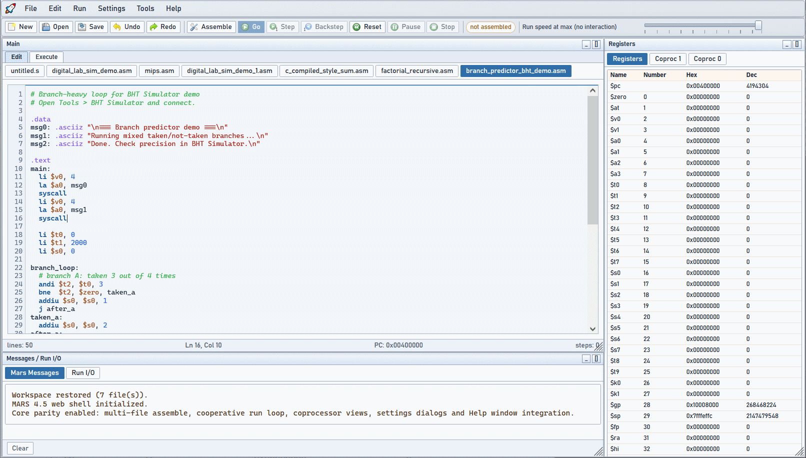

# webMARS v0.4.6

Live test: [https://webmars.nfiles.top/](https://webmars.nfiles.top/)



`webMARS` is a browser implementation of MARS MIPS 4.5: editor, assembler, simulator, help system, and classic MARS tools in a single web UI.

## Overview

- Single-page IDE for editing, assembling, running, stepping, backstepping, and debugging MIPS programs.
- Multi-window desktop/mobile UI with registers, text/data segments, labels, messages, Run I/O, and tool windows.
- Built-in help system with localized pages and embedded reference material.
- Persistent browser workspace for files, session restore, settings, and tool state.
- Optional JS/WASM hybrid backend support, while the JavaScript engine remains the compatibility baseline.

## Current Status

- Active project, still evolving.
- Main target is practical compatibility with Java MARS 4.5 behavior inside the browser.
- Some edge cases can still differ from desktop Java MARS.
- The WebAssembly path exists, but should still be treated as experimental/hybrid rather than the primary source of truth.

## Highlights in v0.4.6

- Startup flow was hardened so the loader now waits for actual tool readiness instead of disappearing into a partial UI state.
- Tool bootstrap now uses a complete embedded manifest fallback instead of silently collapsing to a single tool.
- Browser-storage timestamps were fixed, preventing corrupted `updatedAt` values from being truncated to 32-bit integers.
- The built-in help viewer now opens the MIPS reference PDF inside the UI and lets external links and `mailto:` targets open externally as intended.
- Dead legacy frontend code and unreachable runtime/help fallbacks were removed, reducing drift inside the active code path.
- Local static serving was updated so PDF files are returned inline with the correct MIME type.

## Main Capabilities

- Multi-file editor with syntax highlighting, undo/redo, tabs, and read-only handling where appropriate.
- Assemble, Go, Step, Backstep, Pause, Stop, and Reset flows.
- Breakpoints, run-speed control, popup/input syscalls, and runtime state restore.
- Registers, COP0, COP1, text segment, data segment, symbol/label table, and Mars Messages/Run I/O panes.
- MARS-style tools such as Bitmap Display, Cache Simulator, Digital Lab Sim, Keyboard/Display MMIO, and more.
- Localized UI/help resources for `en`, `pt`, and `es`.
- Browser storage for source files with virtual folders and quota management.
- Project/editor/runtime workflow with persistent preferences and recoverable session state.

## Run Locally

From the repository root:

```bash
npm start
```

Or run the local web server directly:

```powershell
.\web\start-web.bat
```

Default URL: `http://localhost:8080`

## Repository Layout

- `web/index.html`: shell page and startup loader.
- `web/assets/js/app.bundle.js`: ordered module bootstrap.
- `web/assets/js/app-modules/00-core.js`: assembler and simulator core in JavaScript.
- `web/assets/js/app-modules/00-core-wasm-*.js`: WASM bridge and hybrid runtime path.
- `web/assets/js/app-modules/10-ui.js`: windowing/layout/UI foundation.
- `web/assets/js/app-modules/20-app-runtime.js`: runtime orchestration, commands, persistence, and integration glue.
- `web/tools/`: pluggable MARS-style tool windows.
- `web/help/`: built-in help, about/info pages, changelog, and reference content.
- `web/wasm/`: C++ sources and generated WebAssembly artifacts.

## Help and Documentation

- The built-in help inside the application is the authoritative user-facing reference.
- Public repository documentation is intentionally kept lightweight and should not override runtime behavior.

## Release Line

- `v0.4.6`: startup hardening, help/PDF fixes, browser-storage timestamp fix, runtime cleanup, dead-code removal
- `v0.4.5`: cloud backend/login productionization + project/editor workflow improvements + storage/sync refinement
- `v0.4.3`: Mini-C/C0 compiler integration + UI renewal and project-first workflow
- `v0.4.2`: UI polish + simulation runtime bug fixes + final MARS 4.5 parity adjustments
- `v0.4.1`: register window fixes + tighter MIPS-like register/memory access behavior
- `v0.4.0`: mobile adaptation + i18n + large stabilization cycle
- `v0.3.9`: UI fixes + WASM (C++) core reimplementation
- `v0.3.8`: core fixes and UI improvements
- `v0.3.7`: initial git baseline
