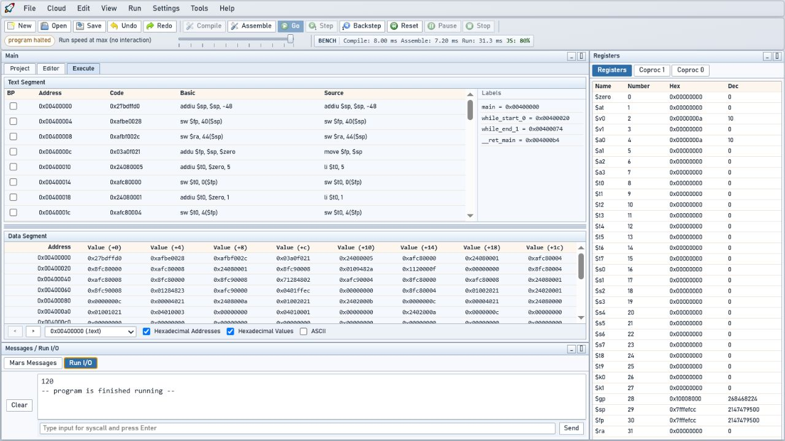

# webMARS v0.4.13

Live test: [https://webmars.nfiles.top/](https://webmars.nfiles.top/)



`webMARS` is a browser implementation of MARS MIPS 4.5: editor, assembler, simulator, help system, and classic MARS tools in a single web UI.

## Overview

- Single-page IDE for editing, assembling, running, stepping, backstepping, and debugging MIPS programs.
- Multi-window desktop/mobile UI with registers, text/data segments, labels, messages, Run I/O, and tool windows.
- Built-in help system with localized pages and embedded reference material.
- Persistent browser workspace for files, session restore, settings, and tool state.
- Single JavaScript assembler and simulator core, with no native runtime dependency.

## Current Status

- Active project, still evolving.
- Main target is practical compatibility with Java MARS 4.5 behavior inside the browser.
- Some edge cases can still differ from desktop Java MARS.
- The runtime deliberately uses one JavaScript implementation to keep behavior, debugging, and maintenance predictable.
- This release is a static web application, not an installable/offline PWA; serve it over HTTP using the included local server or a static host.

## Highlights in v0.4.13

- Rebuilt the mobile layout around one full-screen panel at a time, selected from a new icon tab bar; the page no longer scrolls and the execution controls stay on screen while stepping.
- Mobile toolbar is icon-only in two compact rows, keeping the run controls and the speed picker visible; the file actions are hidden there since they live in the File and Edit menus.
- Localized every assembler and Mini-C compiler diagnostic, converting 114 template literals into named placeholders so the messages can carry a catalog key.
- Added 277 translation keys across `en`, `pt` and `es`, covering runtime messages, parser, semantic, type-checking, contract and code-generation diagnostics.
- Added a release test that fails when any translatable message lacks a catalog entry in all three languages.

Desktop layout, window positions and control sizes are unchanged.

## Main Capabilities

- Multi-file editor with syntax highlighting, undo/redo, tabs, and read-only handling where appropriate.
- Assemble, Go, Step, Backstep, Pause, Stop, and Reset flows.
- Breakpoints, run-speed control, popup/input syscalls, and runtime state restore.
- Registers, COP0, COP1, text segment, data segment, symbol/label table, and Mars Messages/Run I/O panes.
- MARS-style tools such as Bitmap Display, Cache Simulator, Digital Lab Sim, Keyboard/Display MMIO, and more.
- Light and dark interface themes, selected in `Settings > Interface...` and applied to the editor,
  tool windows and help pages.
- Localized UI/help resources for `en`, `pt`, and `es`.
- Browser storage for source files with virtual folders and quota management.
- Project/editor/runtime workflow with persistent preferences and recoverable session state.

## Run Locally

Requirements:

- Node.js 20 or newer.

Install the exact development metadata from `package-lock.json` (the project
has no runtime npm dependencies):

```bash
npm ci
```

Start the local server from the repository root:

```bash
npm start
```

Default URL: `http://127.0.0.1:8080`. Use `npm start -- --port 9000` to select another port.

The Windows-only server remains available as an alternative:

```powershell
.\start-web.bat
```

## Build, Test, and Validate

The browser application is shipped as static source. Its normal build checks the complete script graph, JavaScript/JSON syntax, required assets, and privacy declarations:

```bash
npm run build
```

Run the JavaScript runtime regression tests:

```bash
npm test
```

Run the complete pre-change/pre-commit validation:

```bash
npm run validate
```

Create the isolated, reproducible release directory, ZIP, and SHA-256
checksum under `dist/`:

```bash
npm run package:release
```

The package is assembled from an explicit public-file allowlist and validates
its copied files, manifests, local references, JavaScript/JSON syntax, ZIP
contents, CRCs, and checksums before it is published.

## Runtime Benchmarks

The toolbar includes a compact, local-only benchmark strip for Mini-C compilation, assembly, execution time, and estimated JavaScript utilization. The JS percentage is instrumented main-thread busy time divided by elapsed time; it is not the operating system's total CPU percentage.

Detailed volatile metrics include sample counts, averages, minimum/maximum durations, recent history, outcomes, and execution throughput. They can be inspected while developing with:

```js
window.WebMarsBenchmarks.snapshot()
window.WebMarsRuntimeDebug.getBenchmarks()
```

Measurements are kept only in memory and are neither persisted nor transmitted.

## Repository Layout

- `index.html`: shell page and startup loader.
- `assets/js/app.bundle.js`: ordered module bootstrap.
- `assets/js/app-modules/00-core.js`: assembler and simulator core in JavaScript.
- `assets/css/styles.css`: theme tokens for the light and dark themes plus the base component styles.
- `assets/js/app-modules/10-ui.js`: windowing/layout/UI foundation.
- `assets/js/app-modules/19-runtime-benchmarks.js`: local timing, JS-utilization, and throughput collector.
- `assets/js/app-modules/20-app-runtime.js`: runtime orchestration, commands, persistence, and integration glue.
- `tools/`: pluggable MARS-style tool windows.
- `help/`: built-in help, about/info pages, changelog, and reference content.
- `tests/`: JavaScript runtime regression tests.

## Help and Documentation

- The built-in help inside the application is the authoritative user-facing reference.
- Public repository documentation is intentionally kept lightweight and should not override runtime behavior.

## Release Line

- `v0.4.13`: mobile single-panel layout with icon tabs, icon-only mobile toolbar, and fully localized assembler and Mini-C diagnostics
- `v0.4.12`: dark theme, immediate font-size apply, dead-code cleanup (autosave pipeline, ~15 functions, dead CSS, 113 i18n keys), closeAllFiles wired to menu
- `v0.4.11`: persistent cloud login restoration across refreshes and browser restarts, with updated privacy documentation and regression coverage
- `v0.4.10`: batched tool deltas, lighter runtime UI synchronization, Firefox separator correction, lower idle MMIO polling, and complete 100-step tool parity
- `v0.4.9`: dependable sparse backsteps, synchronous browser tools, Java-compatible random syscalls, stronger state import and expanded runtime/example validation
- `v0.4.8`: delta-based backsteps, synchronous MMIO devices, faster tool delivery, corrected C bitmaps, expanded regression coverage, and optional Bench UI
- `v0.4.7`: JavaScript runtime consolidation, benchmarks, execution correctness, stronger snapshots, expanded examples, complete multilingual help, and release validation
- `v0.4.6`: startup hardening, help/PDF fixes, browser-storage timestamp fix, runtime cleanup, dead-code removal, legacy script/result purge
- `v0.4.5`: cloud backend/login productionization + project/editor workflow improvements + storage/sync refinement
- `v0.4.4`: Mini-C profile and library expansion, runtime coverage, tools, examples, and project workflow improvements
- `v0.4.3`: Mini-C/C0 compiler integration + UI renewal and project-first workflow
- `v0.4.2`: UI polish + simulation runtime bug fixes + final MARS 4.5 parity adjustments
- `v0.4.1`: register window fixes + tighter MIPS-like register/memory access behavior
- `v0.4.0`: mobile adaptation + i18n + large stabilization cycle
- `v0.3.9`: UI fixes + WASM (C++) core reimplementation
- `v0.3.8`: core fixes and UI improvements
- `v0.3.7`: initial git baseline
